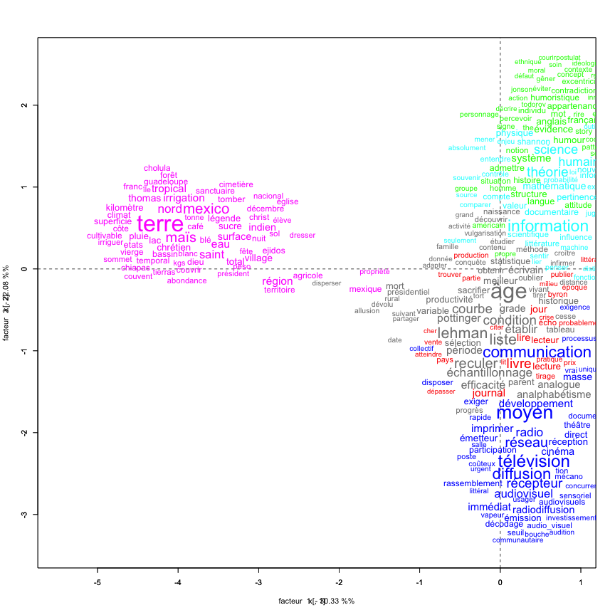
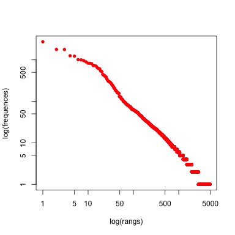
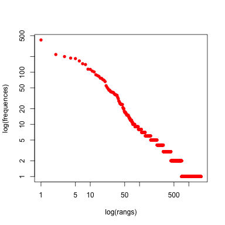
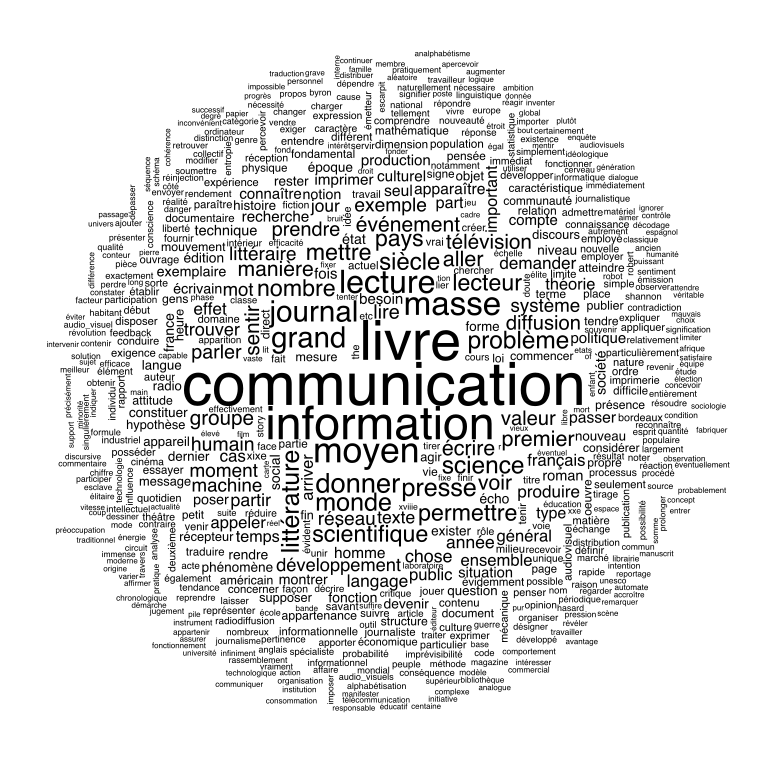
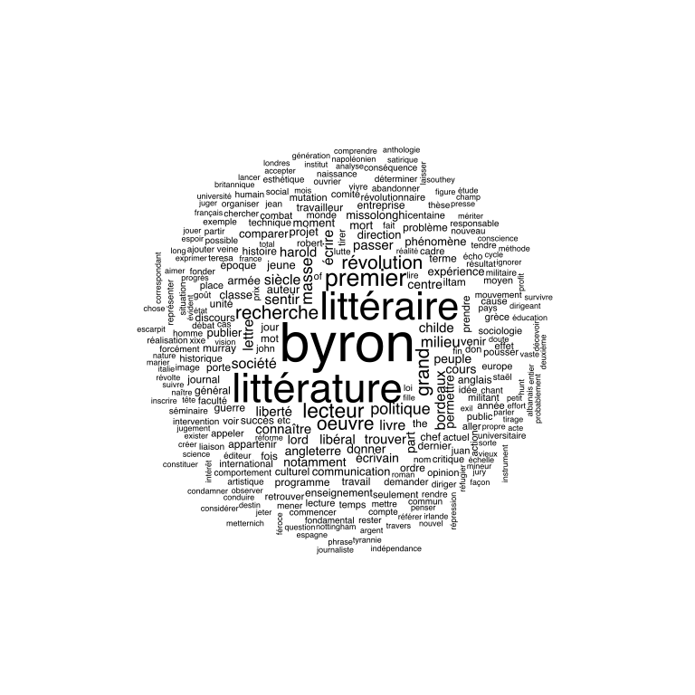
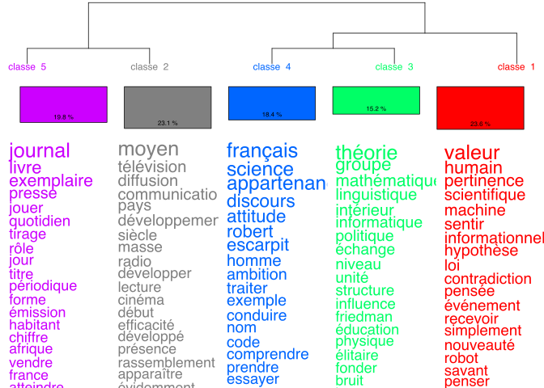
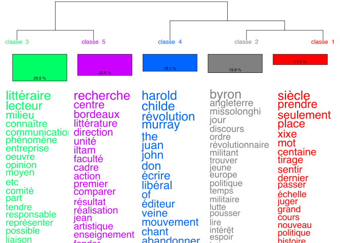

Soniya Abbas ; Ophélie Hersant

10/01/2019

Description
===========

Voici une analyse du corpus sur Robert Escarpit. Elle a été effectuée
dans le cadre du cours "Hyperédition". L'objectif est d'analyser le
corpus textuel qui contient 23 textes de Robert Escarpit sur Iramuteq.
C'est un compte-rendu qui explique toutes les étapes de notre travail et
le résultat obtenu.

Dans un premier temps, on vous présentera toutes les étapes techniques
et préparatoires avant de commencer l'analyse. Ensuite, on fera
l'observation du processus d'analyse des données ainsi que leur
visualisation. Enfin, nous finirons par la conversion du rapport via
Pandoc.

Étape 1. Corpus
===============

Pour commencer le travail nous avons pris les textes classés dans les
*"Articles et Communications scientifiques"* partagés par Lucie
Vieillecroze dans le cadre du **projet ReNum**. Ces textes ont été
nettoyés, car après numérisation ils avaient beaucoup de fautes
techniques. Ensuite, nous les avons regroupés sur [le
drive](https://drive.google.com/drive/u/0/folders/1Q9XiPuiUL8RnBsatS2sW_-IMrQ7uD2aX).

Puis, nous avons nettoyé le texte en supprimant les notes et les
références (car durant la première analyse nous avions pas mal
d'abréviations faisant partie des graphes et ce n'était pas pertinent).
Enfin nous avons ajouté des variables qui nous ont permis d'encoder le
texte et de l'importer dans Iramuteq. Le principe d'encodage est le
suivant :

    Variable : **** *categorie_XXX *categorie_XXX *categorie_XXX *categorie_XXX 
               *titre

Nous avons intégré les méta-données suivantes : - subject - type - date
- langue - titre

Bilan : 23 variables.

Lien vers le fichier avec le corpus
[.txt](https://github.com/soniyabbas/Analyse/blob/master/textes_corrigés_corpus_Escarpit.txt)

> Suite à l'encodage effectué, on peut créer des sous-corpus différents.
> Nous sommes obligées de faire cette action car le corpus général est
> trop lourd - les visualisations ne sont pas représentables ou
> lisibles. C'est pourquoi, nous allons analyser le sous-corpus regroupé
> par la méta-donnée "langue\_français" (les autres langues n'étant pas
> pertinentes dans cette analyse). Puis, nous allons créer encore un
> sous-corpus par thèmes pour comparer les lexiques de thématiques
> différentes (on a pris deux thèmes : information-communication et
> littérature).

Étape 2. Analyse du sous-corpus en français
===========================================

### Statistiques générales

Nous commençons par l'analyse du sous-corpus en français pour voir *ses
statistiques générales*. On choisi tout par défaut pour obtenir le
meilleur résultat dans le petit résumé sur l'information basique des
textes :

  Facteur                           Quantité   Commentaire
  --------------------------------- ---------- --------------------------------------------
  Nombre de textes                  19         
  Nombre d'occurrences              87257      
  Nombre de formes                  7405       
  Nombre d'hapax                    3371       (3.86%des occurrences - 45.52% des formes)
  Moyenne d'occurrences par texte   4592.47    

Sur le graphique, on peut voir la dépendance, la fréquence des mots et
la quantité des occurrences. Les rangs les plus élevés correspondent aux
mots les plus fréquents.

En même temps le logiciel a généré des tableaux .CSV qui nous permettent
de voir les données différentes : - la fréquence décroissante des mots
utilisés dans le corpus au total et leurs types, - les formes les plus
actives sans les articles, propositions, verbes (être et avoir) etc.
(les agents idem : la fréquence et les types) \>nous allons reprendre
ces formes pour toutes nos analyses car elles sont plus pertinentes -
les mots supplémentaires - secondaires, - le nombre de mots utilisés une
seule fois dans le corpus.

### Nuage de mots

Cette analyse est assez simple et représente juste une illustration à
partir des données que l'on utilise. Le but étant de montrer l'ensemble
des mots avec le plus grand nombre d'occurrences déterminées par la
taille de la police.

Là, on ne voit que des sujets principaux de 19 textes étant autour des
mots *"communication", "information", "livre", "masse", "littérature",
etc*.

### Méthode Reinert

C'est la classification hiérarchique descendante qui permet de regrouper
des mots et de les répartir selon des thématiques mesurée par un test au
Chi². L'analyse découpe le texte en segment (dendrogrammes), les
regroupe en classe en fonction des composantes (des mots).

Sur ce graphique, on voit la liste des mots regroupés dans les classes
différentes qui sont à leur tour associées. Une classe représente les
formes.

Cette analyse a regroupé notre corpus en *6 classes*.

Ce monde lexical renvoie de façon évidente aux domaines de l'information
et la communication. En fonction des branches, nous avons des liaisons
entre les mots.

#### AFC (Analyse Factorielle des Correspondances)

Ce type d'analyse nous propose de voir la classification hiérarchique
descendante sur une variable ou sur un ensemble de variables. Elle
organise les données, après transformation statistique, sous forme de
graphique à deux dimensions pour montrer la différence entre les
variables, ce qui nous permet aussi de voir les liaisons entre la
fréquence et le type de mot (la relation lexicale plus généralement).

Ce sont les visualisations liées à l'analyse factorielle de
correspondance mais réalisées à la base de l'analyse Reinert. On peut
prendre pour hypothèse que les *5 classes mélangées décrivent le corpus
principal ; une autre joue un rôle secondaire*.

Les deux graphiques suivants sont modifiés en fonction de critères
supplémentaires (\_dans ce cas, cela rend les graphes illisibles\_).

##### Graphe des classes avec taille des mots proportionnelle à leur fréquence

##### Graphe des classes avec taille des mots proportionnelle à leur score de chi-2

Étape 3. Analyse comparative des textes de deux sujets en français
==================================================================

Afin de rendre l'analyse un peu plus précise, nous avons décidé de
prendre comme exemple l'analyse de deux sujets
(**information-communication et littérature**) que nous avons mis en
évidence au cours de la phase de codage. Ces deux thèmes sont également
parmi les textes en français.

Dans un premier temps, on a créé deux sous-corpus à partir du
sous-corpus des textes en français. Le premier "Infocom" qui possède les
métas-données : *"communication", "infocom" et "information
scientifique"*. Le deuxième "lit" : *"litterature" et "littérature de
masse"*.

Ensuite, nous avons fait les mêmes analyses que dans la deuxième étape.

### Infocom - Statistique générale

  Facteur                           Quantité   Commentaire
  --------------------------------- ---------- --------------------------------------------
  Nombre de textes                  11         
  Nombre d'occurrences              54092      
  Nombre de formes                  4881       
  Nombre d'hapax                    2159       (3.99%des occurrences - 44.23% des formes)
  Moyenne d'occurrences par texte   4917.45    

### Lit - Statistiques générales

  Facteur                           Quantité   Commentaire
  --------------------------------- ---------- ---------------------------------------------
  Nombre de textes                  2          
  Nombre d'occurrences              7301       
  Nombre de formes                  1767       
  Nombre d'hapax                    1052       (14.41%des occurrences - 59.54% des formes)
  Moyenne d'occurrences par texte   3650.50    

### Infocom - Nuage de mots

Cette analyse représente l'illustration à partir des données que l'on
utilise. Le but étant de montrer l'ensemble des mots avec le plus grand
nombre d'occurrences déterminées par la taille de la police.

Ici, les sujets principaux des 11 textes sont les mots "communication",
"information", "livre", "moyen", "donner", "masse" etc.

 \#\#\#
Lit - Nuage de mots

Concernant la littérature, les sujets principaux des 2 textes sont les
mots "littéraire", "byron", "littérature", "lecteur" etc.

### Infocom - Méthode Reinert et AFC

Sur ce graphique, on voit la liste des mots regroupés dans les classes
différentes qui sont à leur tour associées. Une classe représente les
formes.

Cette analyse regroupe notre corpus en 5 classes.

Ce monde lexical renvoie de façon évidente aux domaines de l'information
et la communication mais surtout on remarque que la pertinence se trouve
davantage dans les valeurs du domaine de l'infocom. En fonction des
branches, nous avons des liaisons entre les mots.

### Lit - Méthode Reinert et AFC

Sur ce graphique, on voit la liste des mots regroupés dans les classes
différentes qui sont à leur tour associées. Une classe représente les
formes.

Cette analyse regroupe notre corpus en 5 classes.

Ce monde lexical renvoie au domaine de la littérature avec le lecteur et
la recherche par exemple, mais également à Byron, un des plus illustres
poètes de l'histoire littéraire de langue anglaise. En fonction des
branches, nous avons des liaisons entre les mots.

### Bilan

Par conséquent, suite aux analyses effectuées, il convient de noter que
les textes des deux sous-corpus analysés sont différents les uns des
autres. Tout d'abord, par le fait que le premier est plus grand. Il
contient 11 textes, le second seulement 2. Ce qui sous-entend que parmi
la masse des articles/textes que nous avons fournis, la majorité ont été
écrit par Robert Escarpit sur le thème "Infocom". En revanche, si l'on
regarde les nuages de mots, nous pouvons dire que dans le sous-corpus
"Infocom" se répètent certains mots du second sous-corpus, cependant les
analyses suivantes subdivisent clairement les sujets et en même temps le
vocubulaire touché dans chacun des cas.

Étape 4. Analyse chronologique (AFC)
====================================

Pour cette étape nous avons travaillé un autre sous-corpus à la base de
la méta-donnée "date".

Ce graphique est réalisé avec une fréquence de 30 en utilisant seulement
les formes actives. Cela nous permet d'observer qu'il y a des
correspondances entre les textes, selon lesquels les mots sont utilisés
plus de 30 fois. Sur le premier graphe on remarque la répartition des
mots les plus fréquents ainsi que la distribution de la dépendance par
rapport aux variables "date" (l'image suivante).

------------------------------------------------------------------------

### Conclusion

Nous avons trouvé ce TD très enrichissant, malgré le démarrage lent dû
au retard de l'obtention de certains textes. Nous avons pu travailler
enfin sur un corpus entier de texte, et non pas un seul comme dans les
exercices précédents. Grâce à l'encodage des méta-données, nous avons pu
réaliser des analyses à plusieurs niveaux de variables et créer des
sous-corpus. L'analyse du sous-corpus en français reflète bien les
thèmes qui ont été les centres d'intérêts de Robert Escarpit tout au
long de sa vie. Ces différentes thématiques ont pu être regroupées en
classes et visualisées sous plusieurs formes. Le fait de pouvoir
travailler un corpus sous Iramuteq nous a aussi permis de réaliser une
analyse comparative : trouver les différences et les similitudes entre
les deux grands champs d'étude de Robert Escarpit,
l'Information-Communication et la Littérature.

Sur [Github.com](https://github.com/soniyabbas/Analyse_corpus_iramuteq)
vous pouvez regarder le dossier complet.

P.S. Pandoc
===========

Dans la dernière étape de notre travail a été réalisé la conversion du
fichier **.md** en **PDF** et **HTML**. Tout d'abord, nous avons
téléchargé le travail réalisé sur Github et changé les liens vers les
photos sur les liens locaux (pour le futur fichier HTML, nous avons
changé le format des photos en SVG).

Ensuite, à l'aide du *Terminal* et après l'installation du package
supplémentaire *LaTex* nous avons pu appliquer ces deux commandes et
créé les deux fichiers demandés :

    1. pwd - afin de voir où l'on se trouve (normalement /Users/*nom d'ordinateur/utilisatur*)
    2. cd - changer le dossier où l'on va travailler avec notre fichier .md (cd /Users/*nom
       d'ordinateur/utilisatur*/desktop/analyse_corpus_iramuteq-master
    3. On applique des commandes qui nous aident à transformer le fichier en PDF et HTML :

    pandoc -s -o rapport_analyse.pdf rapport_analyse.md

    pandoc rapport_analyse_2_avec_svg.md -f markdown -t html -s -o rapport_pandoc.html

    pandoc -s -o --css pandoc.css rapport_pandoc.html

Le résultat du travail en Pandoc est
[là](https://github.com/soniyabbas/Analyse_corpus_iramuteq/tree/master/resultat_pandoc).

*Soniya ABBAS et Ophélie HERSANT*
